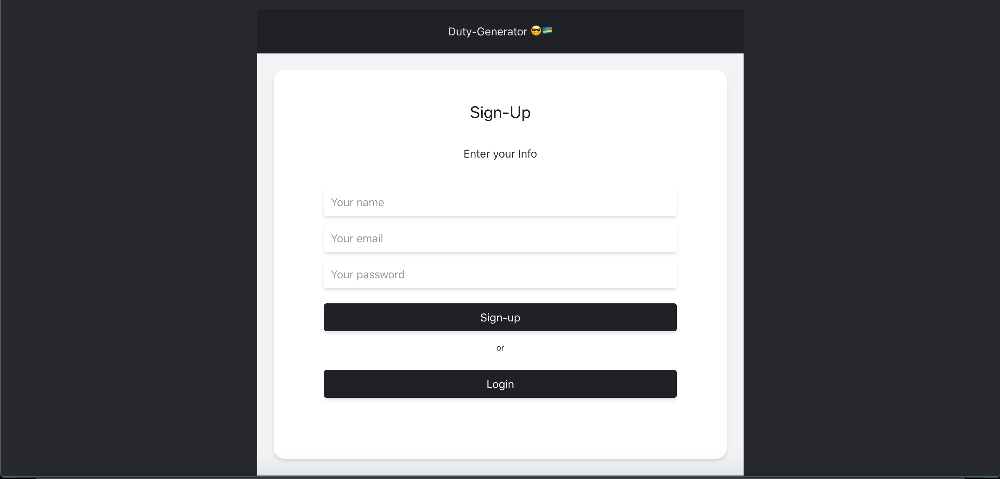

<!--  -->
[](https://codeclimate.com/github/pextech/Duty-generator_taskforce/maintainability)
[](https://coveralls.io/github/pextech/Duty-generator_taskforce?branch=develop)

# DutyGenerator-Backend 😎🇷🇼 (Task-Force-Challenge)



# API Endpoints included

### User

- **POST /signUp:** Create an account
- **POST /login:** Log into your account

### Duty (task)

- **POST /api/v1/duties:** Create a new Task
- **GET /api/v1/duties/:ID:** Fetch a single Task 
- **GET /api/v1/duties:** Fetch all tasks
- **PATCH /api/v1/duties:ID:** Update a single task
- **DELETE /api/v1/duties:ID:** Delete a task

**To Access Docker image/container:**

**Pull the image from [Dockerhub](https://hub.docker.com/layers/138733029/pextech/dutygen/lastest/images/sha256-2749a5a151ee698ceae3880cd65879ff6a83704c5c17203f996031410f4cb8e9?context=explore)**

- after pulling the image which is `pextech/dutygen:latest` make sure you run this command to start the container `docker run pextech/dutygen:latest`


# Installation and Environment Setup

**Clone the repository from [Github](https://github.com/pextech/Duty-generator_taskforce.git).**

( You will need **Git** for this if you are running a Windows PC, Get it [HERE](https://git-scm.com/) )

```git clone https://github.com/pextech/Duty-generator_taskforce.git```

**To Install all dependencies:**

```npm install```

**To run the tests:**

```npm run test```

**Now to start the app:**

```npm run start```

**To start the app in development mode:**

( You need **nodemon** installed for this, run `npm i -g nodemon` to install it )

```npm run dev-start```

# Tools used

- Server-Side Framework: **Node/Express**
- Testing framework: **Mocha/Chai**
- database: **sequelize, postgres**

# More Tools

- Continuous integration: **[Travis-Ci](travis-ci.org)**
- ES6 Transpiler: **[Babel](babeljs.io)**
- Test coverage: **[nyc](https://www.npmjs.com/package/nyc)**
- Maintainability: **[Code climate](https://codeclimate.com)**
- Deployment: **[Heroku](https://www.heroku.com)** and **[Netlify](https://www.netlify.com/)**

# Author 

` Pextech 😎🇷🇼 `